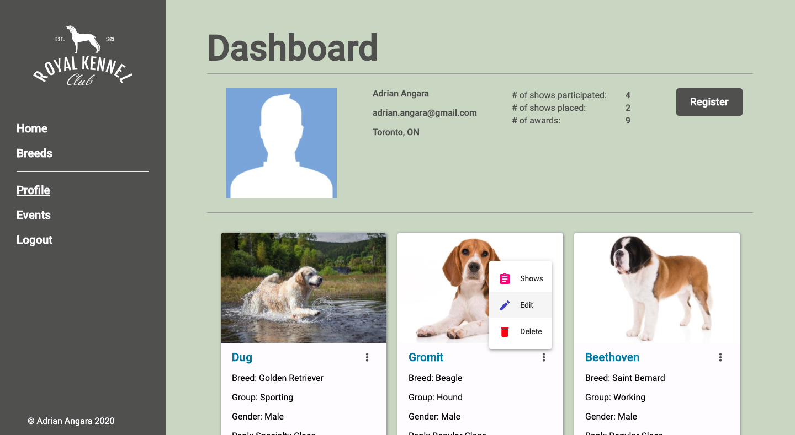
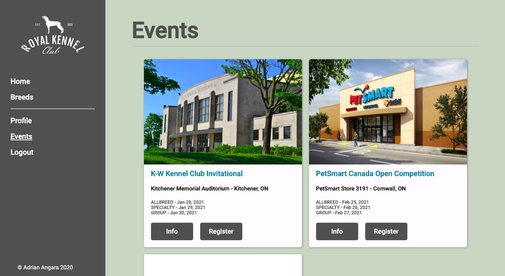
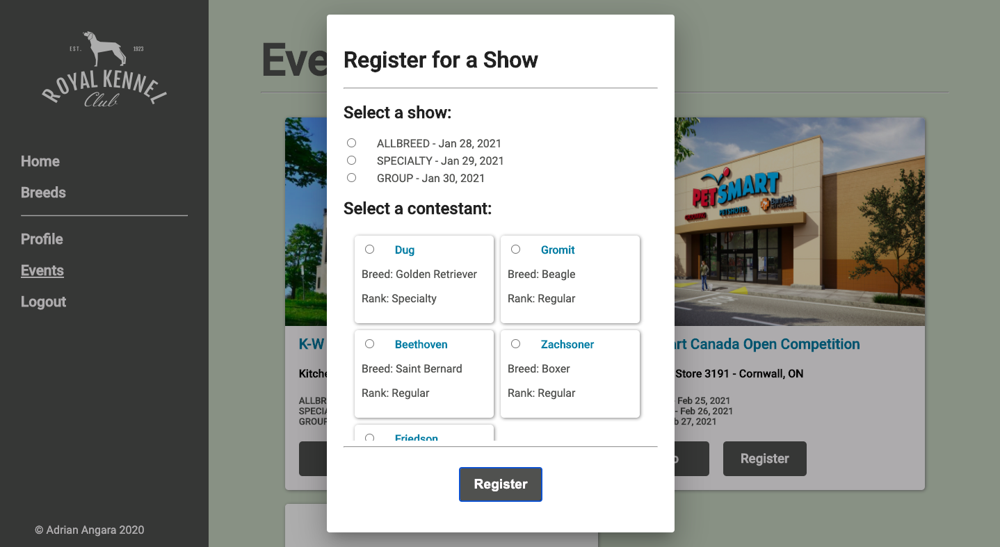
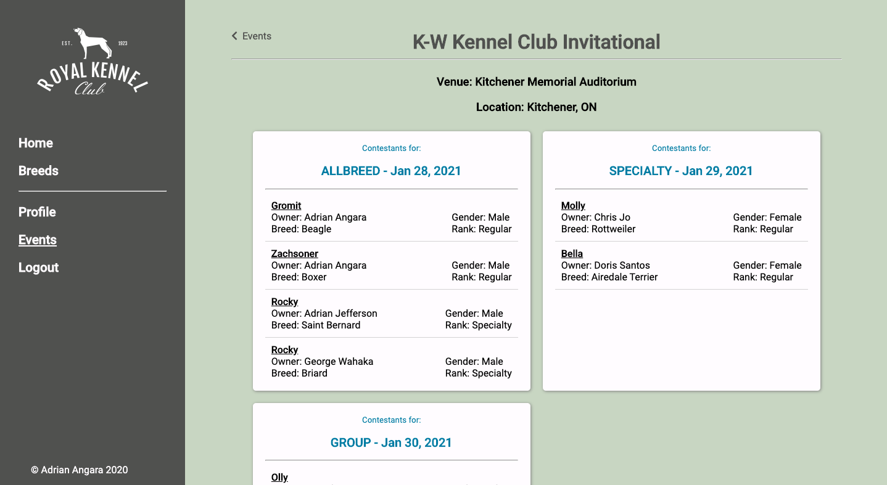

# Royal Kennel Club

####Access the demo for this project [here](https://royalkennelclub-ng.herokuapp.com/#/).

####The client side Angular application's repository can be found [here](https://github.com/As2angara/RoyalKennelClub_Client)

This is a repository showcasing a full-stack web application for conformation show enthusiasts.
Users of this application are able to: 
* Register themselves as dog owners
* Register their own dogs they would like to enroll into conformation events
* Edit, and Remove dogs from their roster
* Sign up for events, and shows
* Display the list of events, their hosts, and contestants of certain shows

## Development
The tech stack for this project include the following: 
* Angular for the client side web portal 
* Spring/SpringBoot for the server side, and RESTful Services
* JDBC to connect the MySQL database
* Heroku foe deploying both the client and server side applications
* Mac OS as the development environment

## User Interfaces
The layout of the main user profile was created with common design features in mind. 
A top container featuring all the important user information
and a grid layout container below showcasing the various dog contestants in the user's roster. 

The main inputs in this interface include a vertical ellipse giving the user options for editing, deleting and viewing. 
As well as the main register button to add a dog to their roster. 

The following three interfaces display the user input flow of the events page. 
The first screen showing the main events page. Second interface displays the modal box form to register a dog in the user's roster. 
The last one features the information page of the specified event selected. Information such as date, location, and the contestant list of each show.

